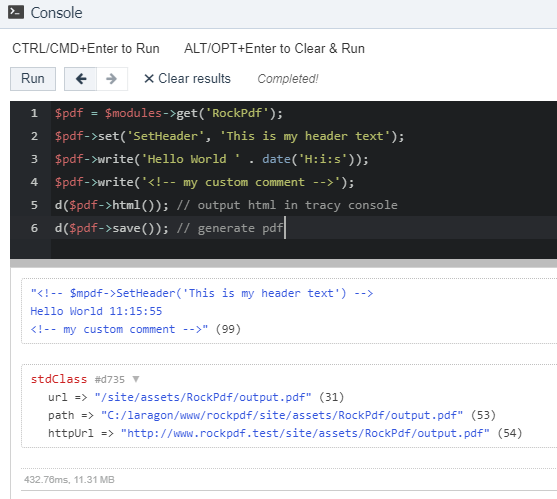
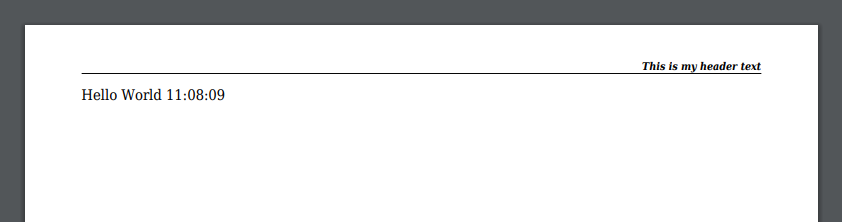

# RockPdf Docs

## Getting the mpdf instance

You can do anything that is possible with Mpdf using the mpdf instance:

```php
$pdf = $modules->get('RockPdf');
$mpdf = $pdf->mpdf;
```

See the mpdf docs: https://mpdf.github.io

## Helper shortcuts

Using mpdf directly can be fine, but this module ships with some helpers/shortcuts that make
working with mpdf and processwire easier. One example is debugging. When using Mpdf
debugging can be tedious because you might get some unwanted results in your pdf and
you don't know what's causing this problem. Getting only the generated HTML is also
not possible by default and you would need to implement some other output strategy like
shown here: https://mpdf.github.io/getting-started/html-or-php.html;

My solution is simple: There are some custom proxy functions that forward your instructions
to Mpdf and log this request as HTML comment. You can then output the generated HTML
**without generating the PDF** (wich is quicker and a lot easier to debug - think
of wrong filepaths for example). You can even use the tracy console to check your code:

```php
$pdf = $modules->get('RockPdf');
$pdf->set('SetHeader', 'This is my header text');
$pdf->write('Hello World ' . date('H:i:s'));
$pdf->write('<!-- my custom comment -->');
d($pdf->html()); // output html in tracy console
d($pdf->save()); // generate pdf
```

Output:




## Different output types

You can use these methods to output your pdf files:

* save() to save your file to the file system
* show() to directly show your file in the browser
* download() to force the browser to download the pdf

## Using fonts

By default MPdf ships with a lot of fonts making the module over 80MB large. I removed almost all of them and you can place the fonts you need in your sites assets folder `/site/assets/RockPdf/fonts`. See https://mpdf.github.io/fonts-languages/fonts-in-mpdf-7-x.html

* Get any TTF font and copy it to `site/assets/RockPdf/fonts`
* Import this font in your code:

```php
// tracy console
$pdf = $modules->get('RockPdf');
$pdf->settings([
  'fontdata' => (new \Mpdf\Config\FontVariables())->getDefaults()['fontdata'] + [
    'test' => [
      'R' => 'Garuda.ttf',
      'I' => 'Garuda.ttf',
    ]
  ],
]);
$pdf->write('Hello World ' . date('H:i:s'));
$pdf->write('<p style="font-family: test;">Hello World ' . date('H:i:s') . '</p>');
d($pdf->save());
```

## Using FontAwesome 5 with mPDF

* Download a copy of fontawesome (https://fontawesome.com/download, eg Free for Web)
* Copy the TTF file into your `/site/assets/RockPdf/fonts/` folder
* Add your font to your settings and start using icons in your PDFs

```php
// tracy console
$pdf = $modules->get('RockPdf');
$pdf->settings([
  'fontdata' => (new \Mpdf\Config\FontVariables())->getDefaults()['fontdata'] + [
    "far" => [
      'R' => "fa-regular-400.ttf",
      'I' => "fa-regular-400.ttf",
    ],
  ],
]);
$icon = "<i style='font-family: far;'>&#xf118;</i> ";
$pdf->write($icon.'Hello World ' . date('H:i:s'));
d($pdf->save());
```


You'll notice that we used the unicode representation of the icon. You can find
all the codes on the cheatsheet (https://fontawesome.com/cheatsheet) or on the
details page of the icon: https://fontawesome.com/icons/smile?style=regular

Be careful to use the correct style (regular, solid, etc) and unicode!
Special thx to 
[jamesfairhurst](https://github.com/mpdf/mpdf/issues/49#issuecomment-259455136)

### Using metadata to get the unicode

Too complicated? RockPdf comes with a helper so that you do not need to take
care of all this and just use the regular fontawesome classes that you might
already be familiar with! To make that work, just copy the icons.json file that
is shipped with fontawesome in the `metadata` folder into the RockPdf assets
folder `/site/assets/RockPdf/fonts`.

```php
// tracy console
$pdf = $modules->get('RockPdf');
$pdf->settings([
  'fontdata' => (new \Mpdf\Config\FontVariables())->getDefaults()['fontdata'] + [
    "far" => [
      'R' => "fa-regular-400.ttf",
      'I' => "fa-regular-400.ttf",
    ],
  ],
]);
$pdf->write("<style>.far { font-family: far; color: blue; }</style>");
$icon = $pdf->icon('far fa-smile');
$pdf->write($icon.'Hello World ' . date('H:i:s'));
d($pdf->html()); // print content to console
$pdf->save(); // save file to file system
```


Using this technique you can easily style your icons using CSS or even LESS
(when using RockLESS).

### Another example

Unfortunately duotone icons do not work (if you know how to make them work
please drop me a line!). Also styling the icons is sometimes a bit tricky - 
some CSS selectors work while others don't. Using classes directly on the icon
worked best for me:

```php
$icons = $pdf->icon('fas fa-guitar red-2x')
  .$pdf->icon('far fa-guitar red-2x')
  .$pdf->icon('fal fa-guitar red-2x')
  .$pdf->icon('fad fa-guitar red-2x');
```

```css
.fab { font-family: fab; }
.fad { font-family: fad; }
.fal { font-family: fal; }
.far { font-family: far; }
.fas { font-family: fas; }
.red-2x { font-size: 10mm; color: red; }
```


## Setting a Background (using mpdf features)

Example implementation in a custom module:

```php
/**
 * Add Background PDF
 */
public function addBackground($pdf) {
  $page = $this->pages->get("template=settings");
  $pdfs = $page->getUnformatted('calendarbackground'); // files field
  if(!$pdfs OR !$pdfs->count()) return; // no field or no file
  $pdf->mpdf->SetDocTemplate($pdfs->first()->filename);
}
```

## Page margins

```php
$pdf = $modules->get('RockPdf');
$pdf->settings([
  'margin_top' => 50,
]);
$pdf->write('hello world');
$pdf->save();
```

Or via CSS:

```php
$pdf = $modules->get('RockPdf');
$pdf->write("<style>@page { margin: 0 }</style>");
$pdf->write('hello world');
$pdf->save();
```


## Page margins for print with cropmarks

```php
// thx to https://stackoverflow.com/a/50245034/6370411
$pdf = $modules->get('RockPdf');
$pdf->settings([
  'mode' => 'utf-8',
  'format' => [214, 301],
  'img_dpi' => 300,
]);
$pdf->write('
<style>
  @page {
    /* regular A4 paper size is 210x297 */
    size: 211mm 298mm; /* trying some weird format to make sure it works */
    marks: crop;
  }
</style>
Content
');
d($pdf->save());
```


You see that the `Trim Box` shows our custom values 211x298 whereas the bounding
box would show the paper size (214x301).

## Combine RockPdf and RockLESS

```php
$pdf = $modules->get('RockPdf');
$less = $modules->get('RockLESS');
$style = "
@padding-s: 10pt;
.border { border: 1pt solid #afafaf; }
.hello { .border; color: blue; padding-top: @padding-s; }
.world { .border; color: red; padding-top: @padding-s * 2; }
";
$css = "\n".$less->parse($style);
$pdf->write("<style>$css</style>");
$pdf->write("<div class='hello'>hello</div>");
$pdf->write("<div class='world'>world</div>");
d($pdf->save());
```


This is the result of `$pdf->html()`

```html
<style>
.border {
  border: 1pt solid #afafaf;
}
.hello {
  border: 1pt solid #afafaf;
  color: blue;
  padding-top: 10pt;
}
.world {
  border: 1pt solid #afafaf;
  color: red;
  padding-top: 20pt;
}
</style>
<div class='hello'>hello</div>
<div class='world'>world</div>
```

## Real life example using RockPdf and RockLESS

```php
// parts of RockPdfCalendar module

  public function init() {
    $this->w = $w = 420; // paper width in mm
    $this->h = $h = 297; // paper height in mm
    $this->b = $b = 2; // bleed in mm

    /** @var RockPdf $pdf */
    $pdf = $this->modules->get('RockPdf');
    $pdf->settings([
      'mode' => 'utf-8',
      'format' => [($w+2*$b), ($h+2*$b)],
      'dpi' => 300,
      'img_dpi' => 300,
    ]);
    $this->addBackground($pdf);
    $this->addStyles($pdf);

    $this->pdf = $pdf;
  }

  /**
   * Add Background PDF
   * @return void
   */
  public function addBackground($pdf) {
    $page = $this->pages->get("template=settings");
    $pdfs = $page->getUnformatted('calendarbackground');
    if(!$pdfs OR !$pdfs->count()) return; // no field or no file
    $pdf->set('SetDocTemplate', $pdfs->first()->filename);
  }

  /**
   * Add styles
   */
  public function addStyles($pdf) {
    /** @var RockLESS $less */
    $less = $this->modules->get('RockLESS');
    $less->vars = [
      'w' => $this->w."mm",
      'h' => $this->h."mm",
      'b' => $this->b."mm",
    ];
    $css = $less->getCSS(__DIR__ . "/style.less")->css;
    $pdf->write("<style>\n$css</style>");
  }
```

Then all you have to do is call `$modules->get('RockPdfCalendar')->show()`
to render the pdf in the browser :)
